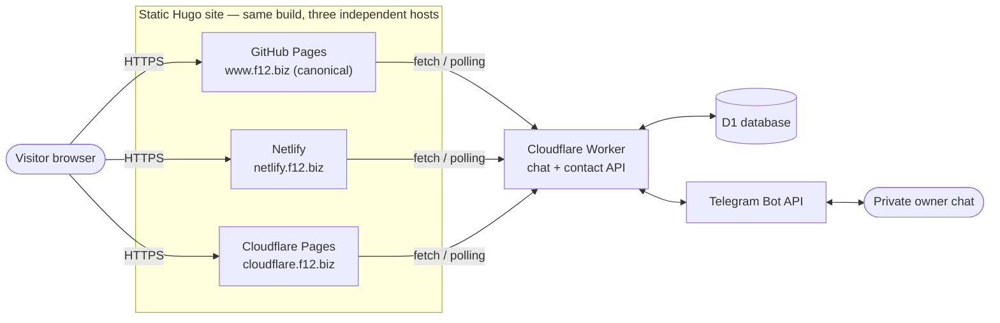
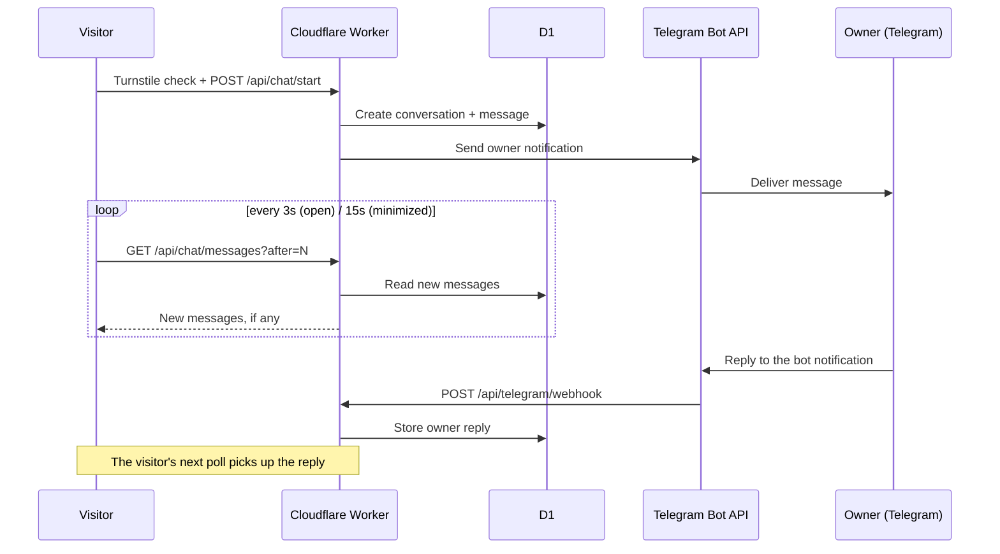
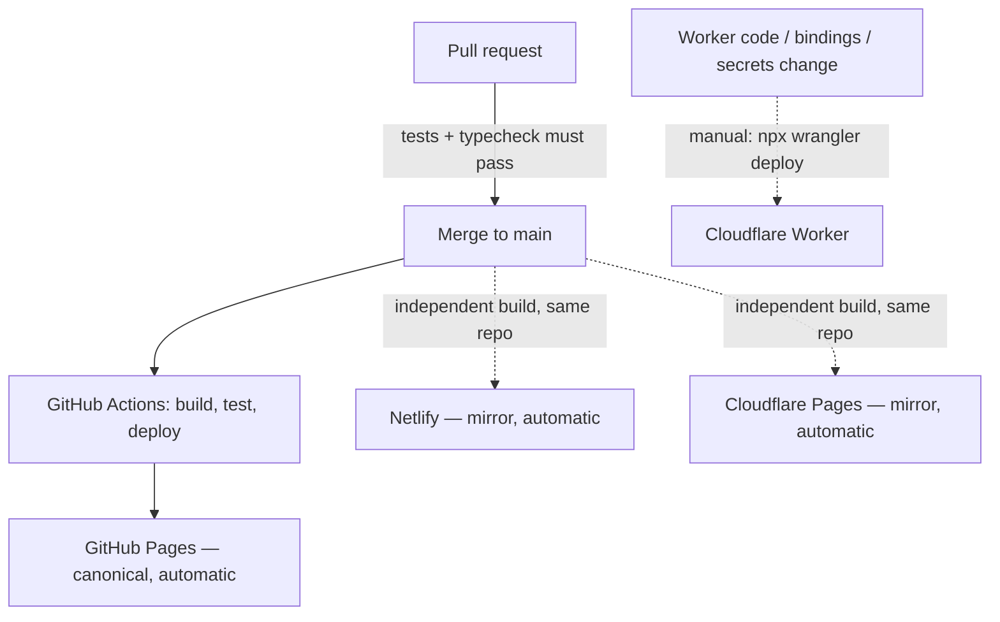

# Personal site + private Telegram chat system

[](https://app.netlify.com/projects/f12-biz/deploys)

A personal system I built and run for myself: a static Hugo site paired with a small serverless backend (Cloudflare Worker + D1) that turns website visits into a private Telegram conversation, plus a legacy contact form the Worker also supports. Website visitors never interact with Telegram directly — the Worker stores conversations and callback requests in D1, sends owner notifications through the Telegram Bot API, and accepts owner replies through a secret-protected Telegram webhook. This document describes how the whole thing fits together; the domain it happens to be deployed on right now isn't load-bearing to any of it, and the same pattern works unchanged under a different one. Sharing it in case the architecture is a useful, concrete reference for something similar you're building.

## Architecture

The same Hugo build is published to three independent hosts. `www.f12.biz` (GitHub Pages) is canonical; Netlify and Cloudflare Pages are mirrors built from the same repository. All three talk to one shared Cloudflare Worker.



Message lifecycle — a visitor's message reaches the owner in Telegram, and a Telegram reply reaches the visitor through the next poll:



- The legacy contact form continues to `POST /` and keeps its existing `{ "success": true }` contract.
- Chat APIs live under `/api/chat/*`. There is no public conversation-list endpoint.
- Every post-creation chat request uses `Authorization: Bearer <session token>` and `X-Conversation-ID`. The browser stores only the session token; D1 stores only its HMAC hash.
- Unsent composer drafts are autosaved only after authentication, stored in D1, restored on the same browser session token, and deleted after send or conversation close. Draft text is never placed in browser `localStorage`.
- Telegram calls, admin chat IDs, webhook secrets, and hashing secrets exist only in Worker secrets.
- Owner replies must be Telegram replies to a mapped bot notification.
- D1 is authoritative. A D1 outbox and five-minute Cron Trigger retry Telegram notifications after transient failures.
- Availability is calculated on the server in `America/Los_Angeles`; no fixed UTC offset is used.

### What works on which domain

The three static hosts serve identical HTML from the same build, but a few integrations are deliberately restricted to the canonical domain — usually because a third-party dashboard (Cookiebot, Turnstile) only authorizes specific hostnames. This table exists because that mismatch caused several rounds of console-error debugging before the pattern was made explicit:

| Feature | `www.f12.biz` (canonical) | Netlify / Cloudflare Pages mirrors |
|---|---|---|
| Static site, chat widget UI | ✅ | ✅ |
| Chat API (start/poll/send) | ✅ | ✅ — same shared Worker |
| Cookiebot consent banner | ✅ | ❌ intentionally gated by hostname (see `layouts/partials/head.html`) — the Cookiebot Manager plan only authorizes the canonical domain |
| Cloudflare Turnstile | ✅ | ✅ — `wrangler.toml`'s `ALLOWED_ORIGIN` and the Turnstile widget's domain list both already include the mirrors |
| Security response headers (`X-Frame-Options`, HSTS, etc.) | ⚠️ meta-tag subset only (GitHub Pages can't set real HTTP headers) | ✅ full set via `static/_headers` (Netlify/Cloudflare Pages honor it) |

When adding a new third-party script or header, check this table first — and update it if the answer changes.

### CI/CD



Netlify and Cloudflare Pages watch the same GitHub repository directly and rebuild independently on every push to `main` — nothing in this repo's own CI triggers them. The Cloudflare Worker is never deployed automatically; it's a deliberate, separate manual step (see step 7 below) so that Worker changes — which touch live conversation data — are never shipped as a side effect of a documentation or frontend PR merge.

See [`ROADMAP.md`](ROADMAP.md) for the current architecture/quality audit and improvement backlog.

## Development, branches, pull requests, and deployment workflow

### Structure

1. Work on `feature/*`, never directly on protected `main`.
2. Run checks locally.
3. Push the feature branch.
4. Open a pull request into `main`.
5. Review checks and merge the pull request.
6. GitHub Actions deploys the Hugo site after the merge.
7. Deploy the Cloudflare Worker separately when Worker code, bindings, or secrets change.

### Why the pull-request command exists

This command creates a pull request from the current feature branch to `main`:

```bash
gh pr create \
  --base main \
  --head feature/website-telegram-chat \
  --title "Keep active chat open across page navigation" \
  --body "Reopens the active chat conversation when visitors navigate between pages."
```

Use it after committing and pushing a change that should enter production. `--base main` selects the protected destination branch; `--head feature/website-telegram-chat` selects the source branch containing your changes; `--title` and `--body` document the intent for reviewers and deployment history. It does not deploy anything by itself.

### Normal change workflow

```bash
git switch feature/website-telegram-chat
git status
npm run check
npm run build
git add <intended-files>
git commit -m "Describe the change"
git push -u origin feature/website-telegram-chat

gh pr create --base main --head feature/website-telegram-chat \
  --title "Describe the change" \
  --body "Explain what changed and how it was tested."
```

Review the PR, wait for required checks, then merge it into `main`. Because `main` is protected, direct pushes and self-approval are blocked unless an administrator deliberately uses a documented bypass. Do not force-push shared branches.

After the merge, GitHub Actions builds and publishes the static Hugo site. Confirm the deployment run is successful before testing the public URL. A Worker change is separate: apply remote D1 migrations when needed, ensure production secrets are present, then run `npx wrangler deploy`. Register the production Telegram webhook only when its URL or webhook secret changes.

For a small follow-up after an earlier PR has already merged, push the new commit to the feature branch and open a new PR; do not push directly to protected `main`.

## 1. Install dependencies

Prerequisites: Node.js 22+, npm, Hugo Extended, a Cloudflare account, Wrangler authentication, a Telegram bot, and a private Telegram admin chat ID.

```bash
npm ci
npx wrangler login
npm run check
npm run build
```

The npm audit report should be reviewed before deployment. Do not run an automatic major-version audit fix without reviewing the resulting diff and tests.

## 2. Create the D1 database

```bash
npx wrangler d1 create website-chat
```

Copy the returned `database_id` into `wrangler.toml`, replacing `REPLACE_WITH_D1_DATABASE_ID`. The binding name must remain `DB` and the database name must remain `website-chat` unless both the configuration and commands below are deliberately changed.

## 3. Apply local migrations

```bash
npx wrangler d1 migrations apply website-chat --local
npx wrangler d1 execute website-chat --local --command "SELECT name FROM sqlite_schema WHERE type = 'table' ORDER BY name"
```

Start the Worker locally in one terminal:

```bash
npm run dev:worker
```

Start Hugo in another terminal. The npm script applies the local-only API override:

```bash
npm run dev:site
```

Keep exactly one Worker terminal and one Hugo terminal running. When Hugo runs in server mode, a compact `Local link` taskbar appears at the bottom of the page:

- `Site` confirms Hugo rendered the page. If the browser cannot open `localhost:1313`, restart `npm run dev:site`; no in-page indicator can render while Hugo itself is stopped.
- `API` checks the local Worker.
- `DB` checks the local D1 binding.
- `Telegram` checks safe webhook, incoming-queue, and notification-outbox status without returning credentials.
- `Poll` reports active, idle, paused, or retrying browser polling.

Each indicator is a keyboard-accessible button. Click or focus and activate it to open a help card with its purpose, recovery command, and current live status; use the refresh button to recheck immediately. The taskbar and its diagnostic endpoint are restricted to Hugo server mode and localhost respectively; production builds do not contain the taskbar.

For local end-to-end Telegram tests, create an untracked `.dev.vars` or use Wrangler secret handling. Never commit local secrets. Unit/integration tests use isolated fake values and never contact Telegram. Local Hugo and Worker scripts use Cloudflare Turnstile official always-pass test keys; production keys are never used by the automated test suite.

## 4. Apply production migrations

Review the SQL first, then apply it before deploying the new Worker:

```bash
npx wrangler d1 migrations list website-chat --remote
npx wrangler d1 migrations apply website-chat --remote
```

All current migrations are additive: `0001_chat.sql` creates the chat data model, `0002_conversation_drafts.sql` adds authenticated unsent-message drafts, and `0003_conversation_sources.sql` identifies chat versus contact-form leads and records a sanitized source path. Do not edit a migration after it has been applied; add a new numbered migration instead.

## 5. Configure Worker bindings and non-secret variables

`wrangler.toml` contains:

- D1 binding: `DB`
- `ALLOWED_ORIGIN`: comma-separated exact origins for the canonical site and existing trusted mirrors
- `OWNER_TIMEZONE=America/Los_Angeles`
- `QUIET_HOURS_START=23`
- `QUIET_HOURS_END=6`
- `CLOSED_RETENTION_DAYS=180`
- `SPAM_RETENTION_DAYS=30`
- `TURNSTILE_REQUIRED=true` fails closed when a conversation is started without server-side verification
- `TURNSTILE_EXPECTED_HOSTNAMES`: comma-separated exact hostnames accepted from Siteverify
- Cron: every five minutes for Telegram outbox retries

The chat API origin is the Worker URL configured by the Hugo partial. If a custom Worker route replaces the workers.dev URL, update `params.chat.apiBase` in Hugo configuration and add that Worker origin to the site CSP `connect-src` header.

Turnstile uses the public site key in `params.chat.turnstileSiteKey`; this value is safe to render in HTML. In the Cloudflare Turnstile dashboard, configure the widget to allow every production hostname listed in `TURNSTILE_EXPECTED_HOSTNAMES`. The Worker independently checks the Siteverify `hostname` and `action` response.

Recommended CSP additions:

```text
script-src 'self' https://challenges.cloudflare.com;
frame-src 'self' https://challenges.cloudflare.com;
connect-src 'self' https://green-rice-1ea7.denis-f21.workers.dev https://challenges.cloudflare.com;
```

## 6. Add every secret

Run each command and paste the value only into Wrangler's hidden prompt:

```bash
npx wrangler secret put TELEGRAM_BOT_TOKEN
npx wrangler secret put TELEGRAM_ADMIN_CHAT_ID
npx wrangler secret put TELEGRAM_WEBHOOK_SECRET
npx wrangler secret put SESSION_HASH_SECRET
npx wrangler secret put TURNSTILE_SECRET_KEY
```

Use the private secret belonging to the configured public Turnstile site key. Generate the webhook and session secrets independently with a cryptographically secure password generator. `SESSION_HASH_SECRET` should contain at least 32 random bytes of entropy. Do not place secrets in `wrangler.toml`, Hugo data, JavaScript, shell history, CI logs, URLs, or this README.

The Worker temporarily recognizes the old `TELEGRAM_TOKEN` and `TELEGRAM_CHAT_ID` names only so the legacy contact form can survive a staged migration. Configure the new names before deployment; remove the old secrets only after both the legacy form and chat are verified.

## 7. Deploy the Worker

Run a local validation and dry run first:

```bash
npm run typecheck
npm run test:worker
npx wrangler deploy --dry-run --env=""
npx wrangler deploy
```

Record the deployed Worker version shown by Wrangler. Do not publish the Hugo frontend until the Worker health, availability, and webhook endpoints are ready.

## 8. Register the Telegram webhook

Use placeholders in recorded documentation and CI. In a private shell, substitute the real bot token, Worker URL, and webhook secret without committing them:

```bash
curl --fail-with-body --silent --show-error \
  --request POST "https://api.telegram.org/bot<TELEGRAM_BOT_TOKEN>/setWebhook" \
  --header "Content-Type: application/json" \
  --data '{
    "url": "https://<WORKER_HOST>/api/telegram/webhook",
    "secret_token": "<TELEGRAM_WEBHOOK_SECRET>",
    "allowed_updates": ["message", "callback_query"],
    "drop_pending_updates": false
  }'
```

Verify it privately:

```bash
curl --fail-with-body --silent --show-error \
  "https://api.telegram.org/bot<TELEGRAM_BOT_TOKEN>/getWebhookInfo"
```

Never paste the resulting command or output into a public issue because the URL contains the bot token.

## 9. Test the health endpoint

```bash
curl --fail-with-body --silent --show-error \
  "https://<WORKER_HOST>/api/health"
```

Expected response:

```json
{"ok":true,"service":"website-chat"}
```

Also verify availability with an allowed Origin:

```bash
curl --fail-with-body --silent --show-error \
  "https://<WORKER_HOST>/api/chat/availability" \
  --header "Origin: https://www.f12.biz"
```

## 10. Test a visitor message

1. Open the deployed website in a private browser window.
2. Open “Chat with Denis.”
3. Confirm the Cloudflare security check completes and the availability text matches Los Angeles local time.
4. Enter test contact information and a non-sensitive message.
5. Confirm the conversation remains visible after refresh and only `f12.websiteChat.sessionToken` is present in localStorage.
6. Confirm D1 contains the conversation and visitor message.
7. Confirm Telegram receives a notification containing the same conversation number.
8. Close the conversation, confirm its transcript remains visible, then use `Start a new conversation` and confirm a fresh conversation and session token are created while the closed D1 record remains unchanged.

Useful safe D1 check (avoid selecting PII in shared terminals or CI):

```bash
npx wrangler d1 execute website-chat --remote \
  --command "SELECT public_number, status, created_at, updated_at FROM conversations ORDER BY public_number DESC LIMIT 5"
```

For an operational summary without personal information:

```bash
npx wrangler d1 execute website-chat --remote \
  --command "SELECT source_type, status, COUNT(*) AS leads FROM conversations GROUP BY source_type, status ORDER BY source_type, status"
```

When you specifically need contact details, run this only in your private terminal because it returns personal information:

```bash
npx wrangler d1 execute website-chat --remote \
  --command "SELECT c.public_number, c.source_type, c.status, c.visitor_name, c.visitor_email, c.visitor_phone, c.created_at, (SELECT m.message_text FROM messages m WHERE m.conversation_id = c.id AND m.sender_type = 'visitor' ORDER BY m.id DESC LIMIT 1) AS latest_message FROM conversations c ORDER BY c.updated_at DESC LIMIT 20"
```

The existing `/contact/` form must also return success, create a `contact_form` conversation and visitor message in D1, and produce a Telegram lead notification. Because a form-only visitor has no chat session, follow up using their supplied email or phone; Telegram reply mapping is intentionally disabled for that notification.

## 11. Test a Telegram reply

1. In the configured admin Telegram chat, reply directly to the bot's website notification.
2. Confirm the website displays the reply within the polling interval.
3. Confirm the conversation status changes to `active`.
4. Send the same webhook update only in an isolated test environment and confirm it does not duplicate the owner message.
5. Test `/pending`, `/open`, `/callbacks`, `/contacted CONVERSATION_NUMBER`, `/close CONVERSATION_NUMBER`, and `/help`.
6. Test the inline Callback pending, Mark contacted, and Close buttons. The How to reply button explains how to use Telegram's native Reply action on the notification.

## 12. Publish Hugo and roll back safely

After the Worker checks pass:

```bash
npm run test:site
npm run build
```

Publish the Hugo site through the existing static-site workflow. No command in this repository automatically pushes or deploys the site.

For a Worker regression, list versions and roll back to the recorded known-good version:

```bash
npx wrangler versions list
npx wrangler rollback <KNOWN_GOOD_VERSION_ID>
```

For a frontend regression, revert the website release/commit through the existing static hosting workflow. The D1 migration is intentionally forward-compatible with the old contact-only Worker, so do not drop tables or delete D1 data during rollback. Preserve the new secrets until the rollback is verified.

## API summary

| Method | Path | Authentication | Purpose |
|---|---|---|---|
| `POST` | `/` | allowed Origin | Legacy contact form |
| `GET` | `/api/chat/availability` | allowed Origin | DST-aware availability and signed form challenge |
| `POST` | `/api/chat/start` | signed challenge + verified Turnstile token | Create conversation and return the one-time session token |
| `GET` | `/api/chat/messages?after=N` | session token + conversation ID | Incremental polling |
| `POST` | `/api/chat/message` | session token + conversation ID | Idempotent visitor message; clears any saved draft |
| `GET` | `/api/chat/draft` | session token + conversation ID | Restore the authenticated unsent composer draft |
| `PUT` | `/api/chat/draft` | session token + conversation ID | Save or clear the authenticated unsent composer draft |
| `POST` | `/api/chat/contact` | session token + conversation ID | Add follow-up email/phone |
| `POST` | `/api/chat/callback` | session token + conversation ID | Save callback request and consent |
| `POST` | `/api/chat/close` | session token + conversation ID | Visitor closes conversation |
| `POST` | `/api/telegram/webhook` | Telegram secret header + admin chat ID | Owner replies, commands, and buttons |
| `GET` | `/api/health` | none | D1 health check without PII |

## Privacy, security, and retention

- Never request or submit passwords, access keys, Social Security numbers, or other sensitive data through chat.
- Inputs are length-limited and validated on the server. D1 statements are parameterized, and Telegram HTML is escaped.
- Request bodies are limited to 16 KiB. Conversation creation requires server-validated Cloudflare Turnstile with exact action and hostname checks, a signed minimum-time challenge, an empty honeypot, and hashed-IP rate limits.
- Logs contain safe diagnostic codes and conversation/outbox numbers only—not raw tokens, IP addresses, full emails, full phone numbers, or Telegram credentials.
- Closed conversations are eligible for retention cleanup after 180 days; spam after 30 days; open business conversations remain until manually closed.
- Automatic deletion is intentionally disabled. Retention eligibility must remain tested before any future cleanup command or scheduled deletion is introduced.
- External meeting-link creation is a future extension point. Telegram bots cannot initiate native Telegram voice or video calls.


## Sentry Worker error monitoring

The Cloudflare Worker uses the official `@sentry/cloudflare` SDK for Error Monitoring only. Session Replay, logs, metrics, and tracing are disabled. Sentry receives sanitized exception context; request bodies, cookies, authorization headers, Turnstile responses, Telegram credentials, visitor messages, names, email addresses, and phone numbers are removed.

Store the DSN only as a Worker secret (never in source, Hugo data, or browser JavaScript):

```bash
npx wrangler secret put SENTRY_DSN
npx wrangler secret list
```

`secret list` prints names only, not values. Set the secret separately for each Worker environment that should report errors.

### Safe integration test

The temporary `POST /api/sentry-test` route is disabled unless `SENTRY_TEST_ENABLED=true` and requires a non-production `ENVIRONMENT` plus a secret `SENTRY_TEST_KEY` request header. Store `SENTRY_TEST_KEY` as a secret, never in source-controlled vars. Start a local Worker with the key kept in your shell (do not commit it):

```bash
export TEST_KEY="$(openssl rand -hex 16)"
npx wrangler dev --var ENVIRONMENT:preview --var SENTRY_TEST_ENABLED:true --var SENTRY_TEST_KEY:"$TEST_KEY"
```

In another terminal, trigger the test using POST only:

```bash
curl -i -X POST http://localhost:8787/api/sentry-test \
  -H "Origin: http://localhost:1313" \
  -H "X-Sentry-Test-Key: $TEST_KEY"
```

The response is a safe JSON success response containing only `ok`, `sentryTest`, and a request ID; verify the event named `F12 Sentry Worker integration test` in the Sentry project `f12-cloudflare-worker`. Remove the temporary route and `SENTRY_TEST_KEY` handling after verification, then redeploy. Never add a production test key or expose a GET test endpoint. Disable the route afterward by removing the temporary test code or leaving `SENTRY_TEST_ENABLED=false`.

Recommended Worker variables are `SENTRY_SUCCESS_EVENT_SAMPLE_RATE="0.10"`, `SENTRY_REJECTION_EVENT_SAMPLE_RATE="1.0"`, `SENTRY_SLOW_REQUEST_MS="3000"`, and `SENTRY_TEST_ENABLED="false"`. If testing, set the key as a secret with `npx wrangler secret put SENTRY_TEST_KEY`, then enable the test only in a preview/local environment.

Operational events are sampled in production (`SENTRY_SUCCESS_EVENT_SAMPLE_RATE=0.10`) and rejection/failure events are retained at full rate. Request IDs, fixed route names, timing buckets, Turnstile booleans, and Telegram status classes are sanitized; visitor content and credentials are never sent. A future separate Sentry Browser project (for example `f12-hugo-frontend`) can monitor chat UI opens, client validation, failed fetches, JavaScript errors, responsiveness, and privacy-masked replay without adding a browser SDK here.


Useful Sentry searches:

```text
message:"F12 Sentry Worker integration test"
message:"F12 chat submission received"
message:"F12 chat delivery succeeded"
message:"F12 Turnstile validation failed"
message:"F12 Telegram delivery failed"
```
